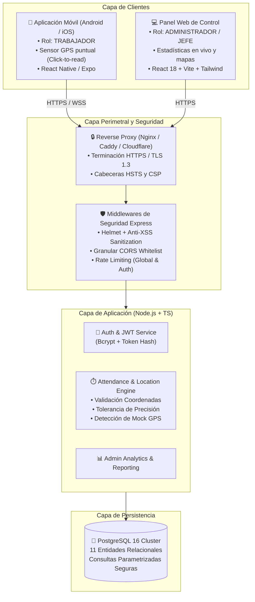

# FITXAI - Arquitectura del Sistema

Sistema profesional de control horario y fichajes para empresas, diseñado para escalabilidad empresarial, alta seguridad y respeto estricto a la privacidad laboral.

---

## 1. Visión General de la Arquitectura

---

## 2. Separación de Responsabilidades

| Directorio | Propósito | Tecnologías Clave |
|---|---|---|
| `/frontend` | Panel de control para administradores y jefes | React 18, Vite, TypeScript, Tailwind CSS, Lucide |
| `/mobile` | Aplicación nativa/móvil para trabajadores | React Native, Expo, TypeScript, Geolocation API |
| `/backend` | Servidor API RESTful y reglas de negocio | Node.js, Express, TypeScript, Zod, Bcrypt, Helmet |
| `/database` | Esquemas, migraciones y seeds SQL | PostgreSQL 16, Prisma Schema, SQL DDL Migrations |
| `/shared` | Tipos TypeScript, interfaces y contratos comunes | TypeScript (dist y types declarados) |
| `/config` | Entornos (.env) separados | development.env, staging.env, production.env |
| `/tests` | Pruebas automatizadas de integración y esquema | Node.js Test Runner, PG integration tests |
| `/docs` | Documentación técnica, arquitectónica y legal | Markdown, Mermaid |

---

## 3. Seguridad Implementada

1. **Prevención de SQL Injection**:
   - Todo acceso a base de datos se realiza mediante sentencias parametrizadas (`$1, $2, ...`) a través del Pool de PostgreSQL. Cero concatenación directa de cadenas SQL.
2. **Protección XSS y Sanitización**:
   - Headers estrictos mediante Helmet (`Content-Security-Policy`, `X-Content-Type-Options: nosniff`).
   - Middleware de sanitización que intercepta y neutraliza scripts en cuerpos JSON.
3. **Control de Acceso y Roles**:
   - Tokens JWT firmados con HMAC SHA-256 (`JWT_SECRET`).
   - Verificación de roles en cascada (`requireRole(UserRole.ADMIN)`).
4. **Rate Limiting**:
   - Limitador global para prevenir sobrecarga y scraping.
   - Limitador estricto específico en `/api/v1/auth/login` (máximo 15 intentos por IP cada 15 min) para mitigar ataques de fuerza bruta.
5. **CORS Configurable**:
   - Lista blanca estricta configurable por variable de entorno `CORS_ORIGIN`.
